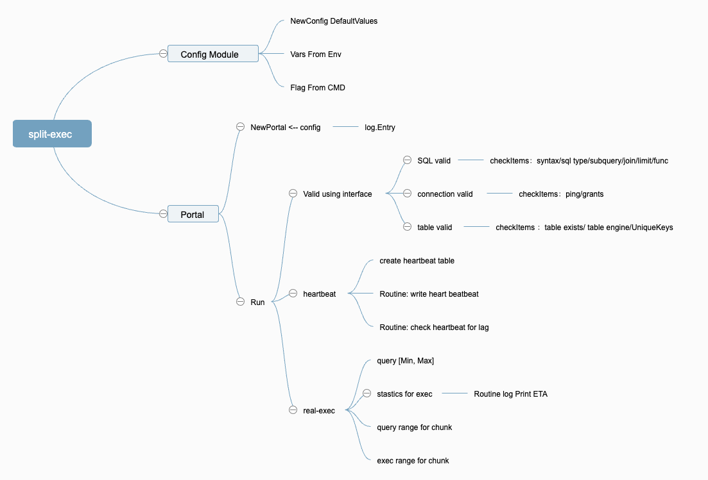

# split-exec

**split-exec: A sleek and efficient database Online DML change tool with zero online impact, perceptible progress, and controllable latency.**

**current status: developing, Maybe product first available release at April 15 2024**

## Why?

When using a database (such as MySQL or PostgreSQL), we often need to perform DML operations that can affect a large amount of rows. This type of SQL, referred to as "Big-SQL" in the following text.

For example, when data expires, we may want to:
- Mark old data as deleted. This can be done using a SQL update statement like:

  `update online_task status='deleted' where create_time<'2023-02-01'`
- Delete old data to reclaim space. This can be achieved with an SQL delete statement like:

  `delete from online_task where create_time<'2023-02-01'`
- Migrate data from the live table to an archive table. This can be done using an SQL insert statement like:

  `insert into archive_task select * from online_task where create_time<'2023-02-01`

However, executing `Big-SQL` directly on table may cause many troubles, such as:
- Coarse-grained locks held by `Big-SQL` during executing impact live queries. 
- `Big-SQL` involving large amounts of data cause extensive CPU and IO operations. 
- Replaying `Big-SQL` also costs too long time, during replaying replicas have data latency.

**Risk Summary**: `overhead connection limit`, `connection denied` `accumulation of slow queries` `data latency`.

Otherwise,  executing `Big-SQL` directly like a black-box, we are unable to estimate how much more time is required.

## How?

To address this issue, we aim to split a large SQL query into smaller sub-queries based on the primary key or unique key. 
Additionally, while executing these sub-queries, we monitor the data latency between the master and replicas.

The sample design of flow is like:

***TODO: add***

## Usage

TODO
